# Waterline — Schema Doc (v1, revised)

Companion to `design-doc.md` (section references like §6.1 point there).

**Conventions applied to every table** (not repeated below unless relevant):
- `id` is a UUIDv7 primary key (except tables with a composite key, e.g. `project_counter`,
  `requirement_testcase`).
- Timestamps are `timestamptz`; `created_at`/`updated_at` exist on every table, with
  `updated_at` maintained by the ORM. They come from the base model (`BaseModel`, or `Base` +
  `TimestampMixin` for a composite key), so join and append-only tables have them too.
  Event-time columns such as `linked_at`, `received_at`, and `changed_at` are domain fields
  kept alongside them.
- "enum" means `VARCHAR` + `CHECK` constraint (`native_enum=False`), not a native Postgres enum.
- Constraint and index names follow one naming convention: `pk_<table>`,
  `fk_<table>_<column>_<referred table>`, `uq_<table>_<columns>`, `ck_<table>_<name>`,
  `ix_<table>_<columns>`.
- Soft-deleted tables (`deleted_at`) are filtered out globally unless a query opts in.
- **Classification** (`ClassificationMixin`, design-doc §3.1) on `project`, `requirement`,
  `task`, and `testcase`, each getting the columns in its own slice:
  - `classification_level`: enum internal / confidential / restricted, nullable; null =
    unclassified;
  - `classification_categories`: `text[]`, NOT NULL, default `{}`, with a CHECK that the values
    are a subset of the allowed list: on `project`, `financial`, `proprietary`, `pii`,
    `export_controlled`; on content items, `financial`, `proprietary`, `pii` in v1
    (`export_controlled` is project-only).

  Effective classification (the stricter level, the union of categories) is computed, never
  stored.
- **Columns added in a later slice.** A column that ships in a later slice than its table (it
  references a table, or belongs to a feature, from that slice) has a Notes cell starting with
  exactly `Added in Slice <n>.`, where `<n>` is the slice that adds it, in any of its
  checkpoints. The docs consistency tests report such a column as skipped until slice `<n>` is
  finished (its last checkpoint, or a later slice's, is committed), then require it like any
  other column; a malformed marker is an error. The migration that adds the column follows the
  `migration` skill.

## Entity-Relationship Diagram

Solid lines are real foreign keys. Dotted lines are polymorphic references
(`entity_type` + `entity_id`, no FK).

```mermaid
erDiagram
  WORKSPACE ||--o{ ORGANIZATION : contains
  WORKSPACE ||--o{ WORKSPACE_MEMBERSHIP : has
  USER ||--o{ WORKSPACE_MEMBERSHIP : has
  ORGANIZATION ||--o{ MEMBERSHIP : has
  USER ||--o{ MEMBERSHIP : has
  USER ||--o{ USER_IDENTITY : "links"
  USER ||--o{ SESSION : has
  WORKSPACE |o--o{ AUDIT_EVENT : "scope of"
  USER |o--o{ AUDIT_EVENT : "actor / target"
  ORGANIZATION ||--o{ PROJECT : "owns (composite FK with workspace_id)"
  ORGANIZATION ||--o{ TAG : defines
  ORGANIZATION ||--o{ GITHUB_INSTALLATION : has

  PROJECT ||--o{ PROJECT_MEMBERSHIP : has
  USER ||--o{ PROJECT_MEMBERSHIP : has
  PROJECT ||--o{ PROJECT_COUNTER : "numbers via"
  PROJECT ||--o{ PHASE : "timeline of"
  PROJECT ||--o{ WORKSTREAM : "organized by"
  USER |o--o{ WORKSTREAM : leads

  PROJECT ||--o{ REQUIREMENT : contains
  REQUIREMENT |o--o{ REQUIREMENT : "parent of"
  REQUIREMENT ||--o{ REQUIREMENT_REVISION : "versioned by"
  REQUIREMENT ||--o{ REQUIREMENT_TESTCASE : "verified by"
  TESTCASE ||--o{ REQUIREMENT_TESTCASE : verifies
  WORKSTREAM |o--o{ REQUIREMENT : owns

  PROJECT ||--o{ TASK : contains
  REQUIREMENT |o--o{ TASK : "implemented by"
  TASK ||--o{ SUBTASK : "breaks into"
  USER |o--o{ TASK : "assignee / reporter / reviewer"
  PROJECT ||--o{ SPRINT : contains
  SPRINT |o--o{ TASK : schedules
  PHASE |o--o{ TASK : "scheduled in"
  WORKSTREAM |o--o{ TASK : owns
  PROJECT ||--o{ MILESTONE : contains
  PHASE |o--o{ MILESTONE : "closed by"
  MILESTONE |o--o{ TASK : groups
  TASK ||--o{ TASK_DEPENDENCY : "depends via"

  PROJECT ||--o{ TESTCASE : contains
  WORKSTREAM |o--o{ TESTCASE : owns
  PROJECT ||--o{ TEST_RUN : contains
  PHASE |o--o{ TEST_RUN : "run in"
  SPRINT |o--o{ TEST_RUN : "tested in"
  MILESTONE |o--o{ TEST_RUN : "tested for"
  TEST_RUN ||--o{ TEST_RESULT : records
  TESTCASE ||--o{ TEST_RESULT : "executed as"
  TASK |o--o{ TEST_RESULT : "bug for"

  PROJECT ||--o{ APPROVAL_REQUEST : contains
  APPROVAL_REQUEST ||--o{ APPROVAL : "decided by"
  USER ||--o{ APPROVAL : approves
  REQUIREMENT_REVISION |o--o{ APPROVAL_REQUEST : "approved as"
  REQUIREMENT ||..o{ APPROVAL_REQUEST : "polymorphic"

  PROJECT ||--o{ ACTIVITY_LOG : "feed of"
  USER ||--o{ ACTIVITY_LOG : "changed by"
  USER ||--o{ COMMENT : authors
  TAG ||--o{ ENTITY_TAG : applies

  TASK ||..o{ COMMENT : "polymorphic"
  REQUIREMENT ||..o{ COMMENT : "polymorphic"
  TASK ||..o{ ENTITY_TAG : "polymorphic"
  TASK ||..o{ LINK_ATTACHMENT : "polymorphic"
  TASK ||..o{ ACTIVITY_LOG : "polymorphic"

  GITHUB_INSTALLATION ||--o{ PROJECT_REPOSITORY : grants
  PROJECT ||--o{ PROJECT_REPOSITORY : maps
  PROJECT_REPOSITORY ||--o{ TASK_GITHUB_LINK : "source of"
  TASK ||--o{ TASK_GITHUB_LINK : links
  GITHUB_INSTALLATION |o--o{ GITHUB_WEBHOOK_DELIVERY : receives

  WORKSPACE {
    uuid id PK
    varchar name
    varchar slug UK
  }
  WORKSPACE_MEMBERSHIP {
    uuid id PK
    uuid workspace_id FK
    uuid user_id FK
    varchar role
  }
  ORGANIZATION {
    uuid id PK
    uuid workspace_id FK
    varchar name
    varchar slug
  }
  USER {
    uuid id PK
    varchar email UK
    varchar username UK
    varchar name
    varchar hashed_password
    bool is_active
    bool is_system_admin
    bool must_change_password
  }
  USER_IDENTITY {
    uuid id PK
    uuid user_id FK
    varchar provider
    varchar provider_user_id
    varchar provider_login
  }
  SESSION {
    uuid id PK
    uuid user_id FK
    varchar token_hash UK
    timestamptz expires_at
  }
  MEMBERSHIP {
    uuid id PK
    uuid user_id FK
    uuid organization_id FK
    varchar role
  }
  PROJECT {
    uuid id PK
    uuid organization_id FK
    uuid workspace_id FK
    varchar key
    varchar name
    varchar type
    text_array enabled_modules
    varchar classification_level
    text_array classification_categories
    timestamptz archived_at
  }
  PROJECT_MEMBERSHIP {
    uuid id PK
    uuid project_id FK
    uuid user_id FK
    varchar role
  }
  PROJECT_COUNTER {
    uuid project_id PK, FK
    varchar prefix PK
    int next_value
  }
  PHASE {
    uuid id PK
    uuid project_id FK
    varchar name
    varchar rank
    date start_date
    date end_date
    date baseline_start
    date baseline_end
    varchar status
  }
  WORKSTREAM {
    uuid id PK
    uuid project_id FK
    varchar name
    uuid lead_id FK
    varchar rank
    timestamptz archived_at
  }
  REQUIREMENT {
    uuid id PK
    uuid project_id FK
    int number
    uuid parent_requirement_id FK
    uuid workstream_id FK
    uuid reporter_id FK
    varchar title
    text description_md
    varchar status
    varchar priority
    varchar rank
    varchar classification_level
    text_array classification_categories
    uuid current_revision_id FK
    uuid approved_revision_id FK
    uuid approved_by FK
    int version
    timestamptz deleted_at
  }
  REQUIREMENT_REVISION {
    uuid id PK
    uuid requirement_id FK
    int revision_number
    varchar title
    text description_md
    text change_note
    uuid created_by FK
  }
  REQUIREMENT_TESTCASE {
    uuid requirement_id PK, FK
    uuid testcase_id PK, FK
  }
  TASK {
    uuid id PK
    uuid project_id FK
    int number
    uuid requirement_id FK
    varchar type
    varchar title
    text description_md
    varchar status
    varchar priority
    varchar severity
    date start_date
    date due_date
    varchar rank
    uuid assignee_id FK
    uuid reporter_id FK
    uuid reviewer_id FK
    uuid phase_id FK
    uuid sprint_id FK
    uuid milestone_id FK
    uuid workstream_id FK
    numeric time_estimate
    numeric time_taken
    varchar classification_level
    text_array classification_categories
    int next_subtask_number
    int version
    timestamptz deleted_at
  }
  SUBTASK {
    uuid id PK
    uuid task_id FK
    int number
    varchar title
    text description
    bool is_done
    varchar rank
  }
  TESTCASE {
    uuid id PK
    uuid project_id FK
    int number
    uuid workstream_id FK
    uuid reporter_id FK
    varchar title
    text description
    varchar test_type
    text expected_result
    varchar automation_ref
    varchar classification_level
    text_array classification_categories
    int version
    timestamptz deleted_at
  }
  TEST_RUN {
    uuid id PK
    uuid project_id FK
    varchar name
    bool is_adhoc
    uuid phase_id FK
    uuid sprint_id FK
    uuid milestone_id FK
    varchar environment
    varchar commit_sha
    varchar status
  }
  TEST_RESULT {
    uuid id PK
    uuid test_run_id FK
    uuid testcase_id FK
    varchar status
    text actual_result
    uuid bug_task_id FK
    uuid executed_by FK
    timestamptz executed_at
  }
  SPRINT {
    uuid id PK
    uuid project_id FK
    varchar name
    text goal
    date start_date
    date end_date
    varchar status
  }
  MILESTONE {
    uuid id PK
    uuid project_id FK
    uuid phase_id FK
    varchar name
    varchar kind
    date target_date
    date baseline_date
    varchar status
  }
  APPROVAL_REQUEST {
    uuid id PK
    uuid project_id FK
    varchar entity_type
    uuid entity_id
    uuid requirement_revision_id FK
    varchar status
    uuid requested_by FK
    timestamptz completed_at
  }
  APPROVAL {
    uuid id PK
    uuid approval_request_id FK
    uuid approver_id FK
    varchar decision
    text comment
    timestamptz decided_at
  }
  ACTIVITY_LOG {
    uuid id PK
    uuid project_id FK
    varchar entity_type
    uuid entity_id
    varchar action
    varchar field_changed
    text old_value
    text new_value
    uuid changed_by FK
    timestamptz changed_at
  }
  AUDIT_EVENT {
    uuid id PK
    uuid workspace_id FK
    uuid organization_id FK
    uuid project_id FK
    varchar action
    uuid actor_id FK
    uuid target_user_id FK
    varchar entity_type
    uuid entity_id
    jsonb details
    timestamptz occurred_at
  }
  COMMENT {
    uuid id PK
    varchar entity_type
    uuid entity_id
    uuid author_id FK
    text body_md
    timestamptz deleted_at
  }
  TAG {
    uuid id PK
    uuid organization_id FK
    varchar name
    varchar color
    varchar project_type
  }
  ENTITY_TAG {
    uuid id PK
    uuid tag_id FK
    varchar entity_type
    uuid entity_id
  }
  TASK_DEPENDENCY {
    uuid id PK
    uuid task_id FK
    uuid depends_on_task_id FK
    varchar type
  }
  LINK_ATTACHMENT {
    uuid id PK
    varchar entity_type
    uuid entity_id
    varchar url
    varchar label
    uuid added_by FK
  }
  GITHUB_INSTALLATION {
    uuid id PK
    uuid organization_id FK
    bigint installation_id UK
    varchar account_login
    varchar account_type
  }
  PROJECT_REPOSITORY {
    uuid id PK
    uuid project_id FK
    uuid github_installation_id FK
    bigint github_repo_id
    varchar github_repo_full_name
  }
  TASK_GITHUB_LINK {
    uuid id PK
    uuid task_id FK
    uuid project_repository_id FK
    varchar link_type
    varchar github_ref
    varchar url
    varchar github_status
    varchar link_source
  }
  GITHUB_WEBHOOK_DELIVERY {
    uuid id PK
    varchar delivery_id UK
    bigint installation_id
    varchar event_type
    timestamptz processed_at
    text error
  }
```

The polymorphic dotted lines are drawn for `task` (and `requirement` for approvals) only to keep
the diagram readable; the same references apply to the other entity types listed in the tables
below.

---

## Users, Tenancy & Auth

Three levels: workspace → organization → project, each with its own membership table and roles
(design-doc §4). Project access is always an explicit `project_membership`, except for the
admins who inherit project admin (system admins, workspace owners/admins, owners/admins of the
project's org; design-doc §5).

### `workspace`
| Field | Type | Notes |
|---|---|---|
| id | UUID (PK) | |
| name | varchar | the firm |
| slug | varchar | NOT NULL, unique; format below |
| created_at / updated_at | timestamptz | |

Slugs (workspace and org): lowercase letters, digits, and hyphens, 2–40 characters, starting
with a letter; suggested from the name at creation. Slugs can't be on the reserved list of
top-level browser routes (`rules/identifiers.py`; design-doc §3).

The tenant boundary. The schema supports many; v1 deploys with one, created by the seed CLI
(`wl seed`) alongside the first system admin, who is given a `workspace_membership` with role
owner. No UI creates workspaces. Only workspace owners/admins (and system admins) see the
workspace pages.

### `workspace_membership`
| Field | Type | Notes |
|---|---|---|
| id | UUID (PK) | |
| workspace_id | UUID (FK → workspace) | |
| user_id | UUID (FK → user) | |
| role | enum: owner / admin / member | internal staff |
| created_at / updated_at | timestamptz | |

`UNIQUE(workspace_id, user_id)`; index on `user_id` (access scoping looks memberships up by
user). Members see only the orgs and projects they are assigned to;
owners/admins see everything in the workspace. The last owner of a workspace cannot leave or be
demoted (service-layer check).

### `organization`
| Field | Type | Notes |
|---|---|---|
| id | UUID (PK) | |
| workspace_id | UUID (FK → workspace) | NOT NULL |
| name | varchar | |
| slug | varchar | NOT NULL; same format as the workspace slug; shown in browser URLs (`/{slug}/projects/{key}/…`); renameable, since it only decorates project URLs (design-doc §3). Org-level pages (e.g. `/{slug}/members`) under an old slug 404 after a rename; no slug history is kept |
| created_at / updated_at | timestamptz | |

`UNIQUE(workspace_id, slug)`; `UNIQUE(id, workspace_id)` (target of the project's composite FK).
Index on `workspace_id`. Normally one client; a software-only setup is one workspace with one internal org. GitHub
installations moved to `github_installation` (an org can have several).

### `user`
| Field | Type | Notes |
|---|---|---|
| id | UUID (PK) | |
| email | varchar | unique; stored lowercase (`CHECK (email = lower(email))`); not changeable in v1 |
| username | varchar | unique app-wide; same format as slugs (lowercase letters, digits, and hyphens, 2–40 characters, starting with a letter), but the reserved-route list doesn't apply (`rules/identifiers.py`); user-changeable |
| name | varchar | display name |
| hashed_password | varchar | required (email/password is the primary sign-in) |
| is_active | boolean, default true | false = cannot sign in; sessions deleted and pending approvals replaced on deactivation (design-doc §6.2; not in an archived project) |
| is_system_admin | boolean, default false | may do anything in any org/project, except personal actions such as deciding another person's approval (design-doc §5) and the content of an export-controlled project without an explicit membership (§3.1); granted and revoked only by app CLI commands |
| must_change_password | boolean, default false | set on admin create/reset |
| created_at / updated_at | timestamptz | |

Last active system admin cannot be deactivated or have the flag revoked (service-layer check).

### `user_identity`
| Field | Type | Notes |
|---|---|---|
| id | UUID (PK) | |
| user_id | UUID (FK → user) | |
| provider | enum: github | extend for future providers |
| provider_user_id | varchar | GitHub's numeric user ID (stable across renames) |
| provider_login | varchar | GitHub username, for display |
| linked_at | timestamptz | |
| created_at / updated_at | timestamptz | |

`UNIQUE(provider, provider_user_id)` — one GitHub account links to one user.
`UNIQUE(user_id, provider)` — one GitHub account per user.

### `session`
| Field | Type | Notes |
|---|---|---|
| id | UUID (PK) | |
| user_id | UUID (FK → user) | |
| token_hash | varchar | unique; the cookie holds the raw token, only its hash is stored |
| last_seen_at | timestamptz | |
| expires_at | timestamptz | |
| created_at / updated_at | timestamptz | |

Deleted on sign-out, deactivation, admin password reset, "sign out everywhere", and (other
sessions) on password change. Removing a membership leaves sessions alone: every request
re-checks memberships (design-doc §4, "Sessions"). Session-ending account actions run in the
`auth` area, which owns this table.

### `membership`
| Field | Type | Notes |
|---|---|---|
| id | UUID (PK) | |
| user_id | UUID (FK → user) | |
| organization_id | UUID (FK → organization) | |
| role | enum: owner / admin / member | owners/admins inherit project admin on the org's projects; members get project access only through `project_membership` |
| created_at / updated_at | timestamptz | |

`UNIQUE(user_id, organization_id)`. Last owner of an org cannot leave or be demoted
(service-layer check).

### `project`
| Field | Type | Notes |
|---|---|---|
| id | UUID (PK) | |
| organization_id | UUID (FK → organization) | referenced through the composite FK below |
| workspace_id | UUID (part of the composite FK → organization) | NOT NULL; the org's workspace, copied so keys can be unique per workspace |
| key | varchar | user-entered; 3–6 chars `^[A-Z][A-Z0-9]{2,5}$`; immutable; unique in the workspace |
| name | varchar | |
| type | enum: software / erp / general | seeds default modules and selects display labels (§1.1); changeable by project admins |
| enabled_modules | text[] | seeded from `type`; values: `sprints`, `github` (v1), later `raid`, `status_reports`, `budget`, `data_migration`, `cutover` |
| classification_level | enum: internal / confidential / restricted, nullable | `ClassificationMixin`; null = unclassified; the floor for the project's items (design-doc §3.1) |
| classification_categories | text[] | `ClassificationMixin`; NOT NULL, default `{}`; values: `financial`, `proprietary`, `pii`, `export_controlled`; starts empty (no seeding by type) |
| archived_at | timestamptz, nullable | archived = read-only, hidden by default |
| created_at / updated_at | timestamptz | |

Composite FK `(organization_id, workspace_id)` → `organization(id, workspace_id)`: keeps
`workspace_id` consistent with the org, and replaces a plain FK on `organization_id` (both would
get the same conventional name, `fk_project_organization_id_organization`).
`UNIQUE(workspace_id, key)` (design-doc §3: an ID like `ERP-TA-45` is unambiguous across the
firm's clients).
`CHECK (enabled_modules <@ ARRAY[...allowed modules])` — `sprints` and `github` are allowed from
Slice 1 (design-doc §1.1: the UI disables their features until their slices ship); each v2
module's value is added when that module ships. Disabling a module hides its data; nothing is deleted.
`CHECK (classification_categories <@ ARRAY['financial', 'proprietary', 'pii',
'export_controlled'])`. Set at creation (recorded in `project_created`) or later. Only project
admins lower the level or remove a category; removing `export_controlled` needs an explicit
project admin (a `project_membership` with role admin), and on an export-controlled project so
does any lowering or removal. With `export_controlled`, inherited admins keep management access
but see content only with an explicit membership (design-doc §3.1; the gate is built in Slice
2). Classification changes are recorded as `project_classification_changed` audit events.
No visibility flag: access is always explicit project membership (plus inherited admin).

### `project_membership`
| Field | Type | Notes |
|---|---|---|
| id | UUID (PK) | |
| project_id | UUID (FK → project) | |
| user_id | UUID (FK → user) | |
| role | enum: admin / member / viewer | design-doc §5, "Project roles" |
| created_at / updated_at | timestamptz | |

`UNIQUE(project_id, user_id)`; index on `user_id` (access scoping: "my projects"). Inherited
admins (system admins, workspace owners/admins,
owners/admins of the project's org) need no row.

### `project_counter`
| Field | Type | Notes |
|---|---|---|
| project_id | UUID (FK → project) | composite PK |
| prefix | varchar | composite PK; entity prefix: `RQ`, `TA`, `TC` (module prefixes added as they ship) |
| next_value | integer | next number to hand out |
| created_at / updated_at | timestamptz | |

Allocates project-level numbers (design-doc §3). Rows are created lazily on first use:
`INSERT … VALUES (project, prefix, 2) ON CONFLICT (project_id, prefix) DO UPDATE SET
next_value = project_counter.next_value + 1 RETURNING next_value - 1`. Only the allocation
helper touches this table. Subtasks are numbered by `task.next_subtask_number` instead.

---

## Planning Structure

### `phase`
| Field | Type | Notes |
|---|---|---|
| id | UUID (PK) | |
| project_id | UUID (FK → project) | |
| name | varchar | e.g. Discover, Design, Build, Test, Deploy, Hypercare |
| description | text, nullable | plain text |
| rank | varchar | display order |
| start_date / end_date | date, nullable | current plan |
| baseline_start / baseline_end | date, nullable | approved plan, for slippage |
| status | enum: planned / active / completed | several phases may be active at once |
| created_at / updated_at | timestamptz | |

`UNIQUE(project_id, name)`; `CHECK (end_date >= start_date)` when both are set. Phases may
overlap. Hard delete only while unreferenced (service-layer check). Date and status changes are
logged.

### `workstream`
| Field | Type | Notes |
|---|---|---|
| id | UUID (PK) | |
| project_id | UUID (FK → project) | |
| name | varchar | e.g. Finance, Procure-to-Pay, Data Migration; components on software projects |
| description | text, nullable | plain text |
| lead_id | UUID (FK → user), nullable | |
| rank | varchar | display order |
| archived_at | timestamptz, nullable | hidden from pickers; still shown on existing items |
| created_at / updated_at | timestamptz | |

`UNIQUE(project_id, name)`.

---

## Requirements

### `requirement`
| Field | Type | Notes |
|---|---|---|
| id | UUID (PK) | |
| project_id | UUID (FK → project) | |
| number | integer | displayed `{KEY}-RQ-n`; never reused |
| parent_requirement_id | UUID (FK → requirement), nullable | null = top level; same project; no cycles (service check) |
| workstream_id | UUID (FK → workstream), nullable | Added in Slice 3. Same project; UI defaults a child to its parent's |
| reporter_id | UUID (FK → user) | NOT NULL, set to creator; reassignable by project admins; drives delete permission |
| title | varchar | |
| description_md | text | markdown; includes `## Acceptance Criteria` from template |
| status | enum: draft / approved / in_progress / done / rejected / deferred | only a project admin moves it into `approved` by hand (design-doc §5) |
| priority | enum: critical / high / medium / low | default medium |
| rank | varchar | fractional index; order among siblings |
| classification_level | enum: internal / confidential / restricted, nullable | `ClassificationMixin`; members raise it, project admins lower it; never below the project's in effect (design-doc §3.1) |
| classification_categories | text[] | `ClassificationMixin`; NOT NULL, default `{}`; values: `financial`, `proprietary`, `pii` |
| current_revision_id | UUID (FK → requirement_revision), nullable | latest content revision; set to revision 1 in the transaction that creates the requirement, so never null after creation (nullable only because the requirement row is inserted before its first revision: circular FK) |
| approved_revision_id | UUID (FK → requirement_revision), nullable | revision of the last approval: the request's revision when a request completes, or the current revision when a project admin approves by hand; stays set when the status moves out of `approved` |
| approved_by | UUID (FK → user), nullable | approver whose decision completed the request (when an approver replacement completed it, the counted approver with the latest `decided_at`), or the project admin who approved by hand |
| approved_at | timestamptz, nullable | when the request completed, or when the project admin approved by hand |
| version | integer | optimistic locking |
| search_vector | tsvector (generated) | Added in Slice 6. Title + description; GIN index |
| deleted_at | timestamptz, nullable | soft delete |
| created_at / updated_at | timestamptz | |

`UNIQUE(project_id, number)`.
`CHECK (classification_categories <@ ARRAY['financial', 'proprietary', 'pii'])`.
"Changed since approval" is derived: `approved_revision_id IS NOT NULL AND approved_revision_id
<> current_revision_id`.
`current_revision_id` and `approved_revision_id` → `requirement_revision`, which references
`requirement`: the foreign keys are circular, so the migration adds them with `use_alter` (or
after both tables exist). Autogenerate gets this wrong; review it by hand and test the
downgrade.

### `requirement_revision`
| Field | Type | Notes |
|---|---|---|
| id | UUID (PK) | |
| requirement_id | UUID (FK → requirement) | |
| revision_number | integer | 1, 2, 3… |
| title | varchar | snapshot |
| description_md | text | snapshot |
| change_note | text, nullable | optional "why" |
| created_by | UUID (FK → user) | |
| created_at / updated_at | timestamptz | |

`UNIQUE(requirement_id, revision_number)`. Revision 1 is created with the requirement, in the
same transaction; later revisions on explicit save only when title or description actually
changed (design-doc §6.1). Append-only, so `updated_at` never moves from `created_at`.

### `requirement_testcase`
| Field | Type | Notes |
|---|---|---|
| requirement_id | UUID (FK → requirement) | composite PK |
| testcase_id | UUID (FK → testcase) | composite PK |
| created_at / updated_at | timestamptz | |

Many-to-many. Removing a row is logged as `unlinked` on both sides' history.

---

## Work Items

### `task`
| Field | Type | Notes |
|---|---|---|
| id | UUID (PK) | |
| project_id | UUID (FK → project) | NOT NULL |
| number | integer | displayed `{KEY}-TA-n`; never reused |
| requirement_id | UUID (FK → requirement), nullable | optional; unlinked tasks flagged in UI |
| type | enum: feature / bug / chore / spike / config / data / training | labels mapped per project type |
| title | varchar | |
| description_md | text | markdown |
| status | enum: todo / in_progress / blocked / in_review / done / cancelled | manually set |
| priority | enum: critical / high / medium / low | default medium |
| severity | enum: s1 / s2 / s3 / s4, nullable | defect severity; shown for bugs |
| start_date | date, nullable | |
| due_date | date, nullable | |
| rank | varchar | one global order per project; written by the server outside the ORM (no `version` bump); order by `(rank, id)` |
| assignee_id | UUID (FK → user), nullable | |
| reporter_id | UUID (FK → user) | NOT NULL, set to creator |
| reviewer_id | UUID (FK → user), nullable | single reviewer; may equal assignee |
| phase_id | UUID (FK → phase), nullable | same project |
| sprint_id | UUID (FK → sprint), nullable | Added in Slice 4. Same project |
| milestone_id | UUID (FK → milestone), nullable | Added in Slice 4. Same project |
| workstream_id | UUID (FK → workstream), nullable | same project |
| time_estimate | numeric, nullable | unit-agnostic |
| time_taken | numeric, nullable | unit-agnostic |
| classification_level | enum: internal / confidential / restricted, nullable | `ClassificationMixin` (design-doc §3.1) |
| classification_categories | text[] | `ClassificationMixin`; NOT NULL, default `{}`; values: `financial`, `proprietary`, `pii` |
| next_subtask_number | integer, default 1 | subtask counter; incremented by a direct `UPDATE … RETURNING` outside the ORM so it doesn't bump `version` |
| version | integer | optimistic locking |
| search_vector | tsvector (generated) | Added in Slice 6. GIN index |
| deleted_at | timestamptz, nullable | soft delete |
| created_at / updated_at | timestamptz | |

`UNIQUE(project_id, number)`; `project_id` is immutable. Index on `(project_id, status, rank)`
for board and backlog views. `CHECK (classification_categories <@ ARRAY['financial',
'proprietary', 'pii'])`.

### `subtask`
| Field | Type | Notes |
|---|---|---|
| id | UUID (PK) | |
| task_id | UUID (FK → task) | immutable; a subtask cannot move to another task |
| number | integer | number within its task; displayed `{KEY}-TA-{task number}.{number}` (e.g. `PMT-TA-45.2`); never reused |
| title | varchar | |
| description | text | plain text |
| is_done | boolean | |
| rank | varchar | order within its task |
| created_at / updated_at | timestamptz | |

`UNIQUE(task_id, number)`. Numbers come from `task.next_subtask_number`. No `assignee_id`,
`phase_id`, or `workstream_id` (resolved through the task). Hard-deleted; the counter means a
deleted subtask's number is still never reused.

### `sprint`
Part of the `sprints` module.

| Field | Type | Notes |
|---|---|---|
| id | UUID (PK) | |
| project_id | UUID (FK → project) | |
| name | varchar | |
| goal | text, nullable | |
| start_date / end_date | date | |
| status | enum: planned / active / completed | |
| created_at / updated_at | timestamptz | |

Partial unique index: `UNIQUE(project_id) WHERE status = 'active'`.

### `milestone`
| Field | Type | Notes |
|---|---|---|
| id | UUID (PK) | |
| project_id | UUID (FK → project) | |
| phase_id | UUID (FK → phase), nullable | a gate usually belongs to the phase it closes |
| name | varchar | |
| description | text | plain text |
| kind | enum: milestone / gate / release | gates are signed off via approvals |
| target_date | date, nullable | current plan |
| baseline_date | date, nullable | approved plan, for slippage |
| status | enum: planned / in_progress / approved / released / cancelled | `approved`: gates only (service check), set when the gate's approval request completes or by a project admin (design-doc §6.2) |
| created_at / updated_at | timestamptz | |

Hard delete only while unreferenced (service-layer check); for a gate, any approval request
(pending or past) counts as a reference. Date and status changes are logged.

### `task_dependency`
| Field | Type | Notes |
|---|---|---|
| id | UUID (PK) | |
| task_id | UUID (FK → task) | |
| depends_on_task_id | UUID (FK → task) | |
| type | enum: blocks / related_to | `related_to` stored in canonical order (lower id first) |
| created_at / updated_at | timestamptz | |

`UNIQUE(task_id, depends_on_task_id, type)`; `CHECK(task_id <> depends_on_task_id)`.
Cycle prevention for `blocks` is a service-layer graph traversal. Dependencies on deleted tasks
are ignored.

---

## Testing

### `testcase`
| Field | Type | Notes |
|---|---|---|
| id | UUID (PK) | |
| project_id | UUID (FK → project) | NOT NULL |
| number | integer | displayed `{KEY}-TC-n`; never reused |
| workstream_id | UUID (FK → workstream), nullable | same project |
| reporter_id | UUID (FK → user) | NOT NULL, set to creator; reassignable by project admins; drives delete permission |
| title | varchar | |
| description | text | test steps folded in |
| test_type | enum: unit / integration / e2e / manual / sit / uat / parallel / regression (extendable) | |
| expected_result | text | |
| automation_ref | varchar, nullable | e.g. `tests/api/test_auth.py::test_login` |
| classification_level | enum: internal / confidential / restricted, nullable | `ClassificationMixin` (design-doc §3.1) |
| classification_categories | text[] | `ClassificationMixin`; NOT NULL, default `{}`; values: `financial`, `proprietary`, `pii` |
| version | integer | optimistic locking |
| search_vector | tsvector (generated) | Added in Slice 6. GIN index |
| deleted_at | timestamptz, nullable | soft delete |
| created_at / updated_at | timestamptz | |

`UNIQUE(project_id, number)`. `CHECK (classification_categories <@ ARRAY['financial',
'proprietary', 'pii'])`. **No `status`** — current status is computed from the latest
non-`not_run` `test_result`. **No `requirement_id`** — links live in `requirement_testcase`.

### `test_run`
| Field | Type | Notes |
|---|---|---|
| id | UUID (PK) | |
| project_id | UUID (FK → project) | |
| name | varchar | e.g. "v1.0 regression", "UAT cycle 2", "Ad-hoc — 2026-09-23" |
| is_adhoc | boolean, default false | auto-created per project per day for quick manual results |
| phase_id | UUID (FK → phase), nullable | e.g. a UAT cycle in the Test phase |
| sprint_id | UUID (FK → sprint), nullable | |
| milestone_id | UUID (FK → milestone), nullable | |
| environment | varchar, nullable | "staging", "local", … |
| commit_sha | varchar, nullable | code under test |
| status | enum: planned / in_progress / completed / cancelled | cancelled: abandoned; left out of metrics |
| created_by | UUID (FK → user) | |
| started_at / completed_at | timestamptz, nullable | |
| created_at / updated_at | timestamptz | |

Exit sign-off uses an approval request (`entity_type = test_run`); cancelling the run cancels a
pending one. Test runs are never deleted in v1; an abandoned run is cancelled (design-doc §9).

### `test_result`
| Field | Type | Notes |
|---|---|---|
| id | UUID (PK) | |
| test_run_id | UUID (FK → test_run) | every result belongs to a run |
| testcase_id | UUID (FK → testcase) | |
| status | enum: not_run / passed / failed / blocked / skipped | |
| actual_result | text, nullable | |
| notes | text, nullable | |
| bug_task_id | UUID (FK → task), nullable | bug raised from a failure |
| executed_by | UUID (FK → user), nullable | null until executed |
| executed_at | timestamptz, nullable | |
| created_at / updated_at | timestamptz | |

`UNIQUE(test_run_id, testcase_id)`. A result with an outcome is never deleted; a `not_run` row
(a case only planned into the run) can be removed, and is removed from open runs when its test
case is deleted (design-doc §9). Index on `(testcase_id, executed_at DESC)` for computing
current status.

---

## Approvals

### `approval_request`
| Field | Type | Notes |
|---|---|---|
| id | UUID (PK) | |
| project_id | UUID (FK → project) | for "pending approvals" lists and access scoping |
| entity_type | enum: requirement / milestone / test_run | polymorphic; milestone requests are for gates |
| entity_id | UUID | polymorphic, no FK; parent verified by service layer |
| requirement_revision_id | UUID (FK → requirement_revision), nullable | the revision being approved; required for requirements |
| status | enum: pending / approved / rejected / cancelled | |
| note | text, nullable | context for approvers |
| requested_by | UUID (FK → user) | a project admin (including inherited) |
| completed_at | timestamptz, nullable | set on approved / rejected / cancelled |
| created_at / updated_at | timestamptz | |

`CHECK (entity_type <> 'requirement' OR requirement_revision_id IS NOT NULL)`.
Partial unique index: `UNIQUE(entity_type, entity_id) WHERE status = 'pending'` — one pending
request per entity.
Index `(entity_type, entity_id, created_at)`. Never deleted; cancelled instead (including when a
project admin approves the requirement by hand, design-doc §6.2).
**Policy (v1):** `replaced` rows don't count: approved when every other `approval` row is
approved; rejected on the first rejection. A replacement that leaves every counted row approved
completes the request (design-doc §6.2).

### `approval`
| Field | Type | Notes |
|---|---|---|
| id | UUID (PK) | |
| approval_request_id | UUID (FK → approval_request) | |
| approver_id | UUID (FK → user) | any project role, including viewer; must have project access when the request is created (an explicit membership on an export-controlled project) |
| decision | enum: pending / approved / rejected / replaced | `replaced`: the approver lost the access needed to decide while the row was pending, and the requester still holds project admin; the row keeps its history, and a pending row for the requester is added unless they're already named. If the requester no longer holds project admin, or the project is archived, the row stays `pending` and the request is flagged (design-doc §6.2). Decided rows are never replaced |
| comment | text, nullable | |
| decided_at | timestamptz, nullable | |
| created_at / updated_at | timestamptz | |

`UNIQUE(approval_request_id, approver_id)`. Only the named approver can set `decision` to
approved or rejected (a personal action: no admin or system-admin override, design-doc §5);
`replaced` is a system effect of losing access. Index `(approver_id, decision)` for "my pending approvals".

---

## Audit

### `activity_log`
| Field | Type | Notes |
|---|---|---|
| id | UUID (PK) | |
| project_id | UUID (FK → project) | NOT NULL |
| entity_type | enum: requirement / task / testcase / phase / milestone / approval_request | approval requests log `created`, every `status` change, and `approver_id` when an approver is replaced |
| entity_id | UUID | polymorphic, no FK (log outlives its subject) |
| action | enum: created / updated / deleted / restored / linked / unlinked | |
| field_changed | enum, nullable | required when `action = updated`; values below |
| old_value | text, nullable | serialized; for link events, the other entity's ID |
| new_value | text, nullable | serialized; for link events, the other entity's ID |
| changed_by | UUID (FK → user), nullable | the user whose action made the change; null only when an app CLI command caused it (e.g. an approver replaced after `revoke-system-admin`, design-doc §6.2, §10) |
| changed_at | timestamptz | NOT NULL, `server_default now()`: the transaction's start time, as for `created_at`; `log_change()` never sets it |
| created_at / updated_at | timestamptz | |

`field_changed` values: `status`, `assignee_id`, `reporter_id`, `reviewer_id`, `sprint_id`,
`milestone_id`, `phase_id`, `workstream_id`, `priority`, `severity`, `start_date`, `end_date`,
`due_date`, `target_date`, `baseline_start`, `baseline_end`, `baseline_date`, `requirement_id`,
`parent_requirement_id`, `time_estimate`, `approved_revision_id`, `approver_id`,
`classification_level`, `classification_categories`.
`CHECK (action <> 'updated' OR field_changed IS NOT NULL)`.
Indexes: `(entity_type, entity_id, id)` for item history; `(project_id, id)` for the project
feed. Feeds page by `id` (UUIDv7, increasing in creation order), not by `changed_at`, which is
the transaction's start time and so ties for every entry one request writes; `changed_at` is
for display (build plan, "API conventions"; owner decision, Oct 6, 2026).
**Write path:** only via `log_change(...)`, in the same transaction as the change (design-doc
§10).

### `audit_event`
| Field | Type | Notes |
|---|---|---|
| id | UUID (PK) | |
| workspace_id | UUID (FK → workspace), nullable | null only for instance-level events (system-admin grants and revocations) |
| organization_id | UUID (FK → organization), nullable | set for org- and project-level events, and for user-level events when the actor acted as that org's owner/admin (design-doc §10.1) |
| project_id | UUID (FK → project), nullable | set for project-level events |
| action | enum | values below |
| actor_id | UUID (FK → user), nullable | null when run from the app CLI |
| target_user_id | UUID (FK → user), nullable | the user acted on |
| entity_type | enum: workspace / organization / project / user, nullable | the entity changed, where it isn't just the target user |
| entity_id | UUID, nullable | polymorphic, no FK |
| details | jsonb | action-specific values (old/new role, old/new name or slug, modules; for `project_created`, the initial level and categories and any export-control confirmation; for `project_classification_changed`, the old and new level and categories and any export-control confirmation; for a member added to an export-controlled project, the confirmation); never passwords, hashes, or tokens |
| occurred_at | timestamptz | NOT NULL, `server_default now()`: the transaction's start time, as for `created_at`; `log_admin_event()` never sets it |
| created_at / updated_at | timestamptz | |

`action` values: `workspace_created`, `user_created`, `user_deactivated`, `user_reactivated`,
`password_reset`, `password_changed`, `signed_out_everywhere`, `username_changed`,
`system_admin_granted`, `system_admin_revoked`, `workspace_member_added`,
`workspace_member_role_changed`, `workspace_member_removed`, `org_created`, `org_updated`,
`org_member_added`, `org_member_role_changed`, `org_member_removed`, `project_created`,
`project_updated`, `project_archived`, `project_unarchived`, `project_classification_changed`,
`project_member_added`,
`project_member_role_changed`, `project_member_removed`.
Indexes: `(workspace_id, id)`, `(organization_id, id)`, `(target_user_id, id)`. The feed pages
by `id`, not `occurred_at`, as for `activity_log`; `occurred_at` is for display.
Append-only: `updated_at` never moves from `created_at`.
**Write path:** only via `log_admin_event(...)`, in the same transaction as the change
(design-doc §10.1). Visible to system admins, workspace owners/admins (their workspace), and
org owners/admins (their org); never to project members.

---

## Collaboration

### `comment`
| Field | Type | Notes |
|---|---|---|
| id | UUID (PK) | |
| entity_type | enum: task / requirement | |
| entity_id | UUID | polymorphic; parent verified by service layer |
| author_id | UUID (FK → user) | viewers may comment |
| body_md | text | markdown, sanitized on render; flat (no threading) |
| deleted_at | timestamptz, nullable | shown as "comment deleted" |
| created_at / updated_at | timestamptz | |

Index `(entity_type, entity_id, created_at)`.

### `tag`
| Field | Type | Notes |
|---|---|---|
| id | UUID (PK) | |
| organization_id | UUID (FK → organization) | org-wide vocabulary |
| name | varchar | |
| color | varchar | |
| project_type | enum: software / erp / general, nullable | set on tags seeded from a type's built-in defaults, or by org admins; null = general, offered on every project (tags project members create are general) |
| created_at / updated_at | timestamptz | |

`UNIQUE(organization_id, name)`. Built-in defaults per project type are copied in when an org is
created. Project members create tags; renaming, deleting, and setting a tag's type are for org owners/admins
(design-doc §11).

### `entity_tag`
| Field | Type | Notes |
|---|---|---|
| id | UUID (PK) | |
| tag_id | UUID (FK → tag) | tag's org must match the entity's org |
| entity_type | enum: task / requirement / testcase | |
| entity_id | UUID | polymorphic |
| created_at / updated_at | timestamptz | |

`UNIQUE(tag_id, entity_type, entity_id)`; index `(entity_type, entity_id)`.

### `link_attachment`
| Field | Type | Notes |
|---|---|---|
| id | UUID (PK) | |
| entity_type | enum: task / requirement / testcase | |
| entity_id | UUID | polymorphic |
| url | varchar | |
| label | varchar | |
| added_by | UUID (FK → user) | |
| created_at / updated_at | timestamptz | |

Index `(entity_type, entity_id)`. Links only in v1; file uploads are v2+ (design-doc §16).

---

## GitHub

All tables in this section belong to the `github` module.

### `github_installation`
| Field | Type | Notes |
|---|---|---|
| id | UUID (PK) | |
| organization_id | UUID (FK → organization) | |
| installation_id | bigint | unique; GitHub's installation ID |
| account_login | varchar | e.g. `nick`, `acme` |
| account_type | enum: user / organization | |
| suspended_at | timestamptz, nullable | GitHub can suspend installations |
| created_at / updated_at | timestamptz | |

Connected by org owners/admins. Optional: a project uses GitHub only through
`project_repository` rows.

### `project_repository`
| Field | Type | Notes |
|---|---|---|
| id | UUID (PK) | |
| project_id | UUID (FK → project) | |
| github_installation_id | UUID (FK → github_installation) | |
| github_repo_id | bigint | GitHub's repo ID (stable across renames) |
| github_repo_full_name | varchar | "org/repo", refreshed from webhooks |
| created_at / updated_at | timestamptz | |

`UNIQUE(project_id, github_repo_id)`. A repo may map to several projects.

### `task_github_link`
| Field | Type | Notes |
|---|---|---|
| id | UUID (PK) | |
| task_id | UUID (FK → task) | |
| project_repository_id | UUID (FK → project_repository) | disambiguates `#42` |
| link_type | enum: pr / commit / branch | |
| github_ref | varchar | PR number, commit SHA, or branch name |
| url | varchar | |
| github_status | enum: open / draft / merged / closed, nullable | PRs only; mirrored passively |
| link_source | enum: manual / auto | |
| synced_at | timestamptz, nullable | |
| created_at / updated_at | timestamptz | |

`UNIQUE(task_id, project_repository_id, link_type, github_ref)`.
Auto-detection: task IDs in PR titles and branch names, case-insensitive.

### `github_webhook_delivery`
| Field | Type | Notes |
|---|---|---|
| id | UUID (PK) | |
| delivery_id | varchar | unique; `X-GitHub-Delivery` header — redeliveries processed once |
| installation_id | bigint, nullable | from the payload |
| event_type | varchar | `X-GitHub-Event` header |
| payload | jsonb | raw body, for processing and debugging |
| received_at | timestamptz | |
| processed_at | timestamptz, nullable | null = pending; the sweeper re-enqueues these |
| error | text, nullable | last processing error |
| created_at / updated_at | timestamptz | |

Signature (`X-Hub-Signature-256`) is verified before a row is written.

---

## Infrastructure tables
- **procrastinate**'s job tables live in the same database and are not modeled in the app's
  ORM. Our Alembic migration `add procrastinate schema` applies a vendored copy of
  procrastinate 3.10.0's `schema.sql` (`backend/migrations/sql/`); an upgrade adds a migration
  applying procrastinate's own migration files for the versions in between, a version's
  `_pre_` and `_post_` files together, with the workers stopped. Autogenerate ignores these
  tables (design-doc §13, "Transactional enqueue", item 8).

## Deferred tables (not in v1)
| Table | When |
|---|---|
| `notification` (user_id, type, entity_type, entity_id, actor_id, created_at, read_at) | v1.5 |
| `api_token` (user_id, name, token_hash, prefix, last_used_at, expires_at, revoked_at) | first need |
| `login_attempt` (sign-in throttling per account and per IP, design-doc §4) | before the first non-local deployment |
| `session.user_agent`, `session.ip_address` columns (active-sessions page, design-doc §4) | before the first non-local deployment |
| ERP modules, design pending: `raid_item`, `entity_link`, `status_report`, `budget_line`, `cost_entry`, `data_object`, `load_cycle`, `data_load`, runbook step / rehearsal tables | v2 (design-doc §16) |
| ERP portfolio and team tables, design pending: project portfolio fields and templates (PMO dashboard), workspace teams (resourcing), workstream members | v2 (design-doc §16) |
| `invitation`, `time_entry`, `sprint_project`, `sprint_snapshot`, file attachments | v2+ (`time_entry` may move up with the budget module) |

## Known v1 Limitations (by design)

- **Burndown:** `time_estimate`/`time_taken` are current values. Estimate changes are logged in
  `activity_log`, so a burndown can be reconstructed, but there's no built-in daily series until
  a snapshot job or `time_entry` is added.
- **Sprint history:** a task's `sprint_id` is overwritten when it rolls to the next sprint;
  "committed vs. completed" per sprint is recoverable only from `activity_log` until sprint
  snapshots exist.
- **One baseline per phase/milestone:** re-baselining overwrites the baseline columns; earlier
  baselines are recoverable only from `activity_log`.
- **Fixed statuses** shared by all projects; no per-project workflows.
- **Display labels** are fixed per project type (code-level mapping), not user-configurable.
- **Units** for time fields are a per-project convention, not recorded in the schema.
- **One reviewer** per task.
- **One approval policy:** every named approver must approve.
- **Flat comments**, no threading.
- **Links only**, no file uploads.
- **Passive GitHub sync** — no automatic `task.status` changes from GitHub events.
- **Polymorphic references** (`comment`, `entity_tag`, `link_attachment`, `activity_log`,
  `approval_request`) have no database-level FK; integrity is a service-layer responsibility.
- **Items can't move** between projects (requirements, tasks, test cases) or between tasks
  (subtasks) — the move would change their IDs.
- **Admin audit events have no screen** yet (it comes before the first non-local deployment,
  design-doc §4, §10.1); they're queryable only. Sign-in attempts aren't
  recorded until sign-in throttling (`login_attempt`).
